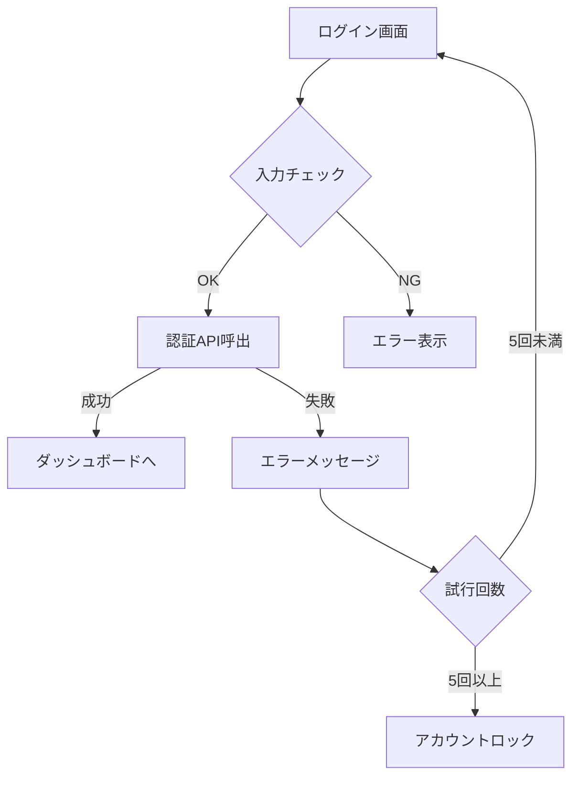
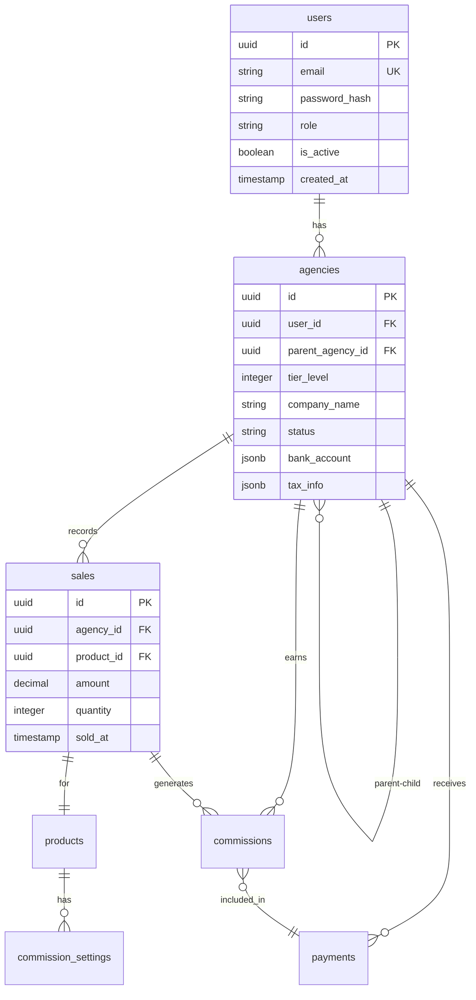

# 多段階営業代理店管理システム 要件定義書（改訂版）

## 📋 システム概要

### プロジェクト名
多段階営業代理店管理システム（Multi-Tier Sales Agency Management System）

### 目的
4階層までの代理店構造を管理し、売上・報酬の自動計算と支払い管理を実現するシンプルで実用的なWebシステム

### 基本方針
- **シンプル優先**：複雑な機能は排除し、必要最小限の機能に絞る
- **実用性重視**：現場で即座に使える機能のみ実装
- **段階的拡張**：将来的な機能追加を考慮した設計

---

## 🎯 ビジネス要件詳細

### 1. 代理店階層管理

#### 1.1 階層構造
```
本社（Company）
├── Tier1代理店（最大100社）
│   ├── Tier2代理店（各50社まで）
│   │   ├── Tier3代理店（各30社まで）
│   │   │   └── Tier4代理店（各20社まで）
```

#### 1.2 代理店属性
```javascript
{
  "agency_id": "AGN20240001",
  "company_name": "株式会社サンプル",
  "company_type": "法人", // 法人/個人
  "representative": {
    "name": "山田太郎",
    "email": "yamada@example.com",
    "phone": "03-1234-5678",
    "birth_date": "1980-01-01" // 18歳以上確認用
  },
  "bank_account": {
    "bank_name": "○○銀行",
    "branch_name": "○○支店",
    "account_type": "普通",
    "account_number": "1234567",
    "account_holder": "ヤマダタロウ"
  },
  "tax_info": {
    "invoice_registered": true,
    "invoice_number": "T1234567890123",
    "withholding_tax": true // 源泉徴収対象
  },
  "status": "active", // pending/active/suspended/terminated
  "tier_level": 1,
  "parent_agency_id": null,
  "created_at": "2024-01-01T00:00:00Z"
}
```

### 2. 報酬体系詳細

#### 2.1 報酬設定管理
```javascript
// 管理画面で設定可能な報酬パラメータ
const commissionSettings = {
  // 商品別基本報酬率
  products: [
    {
      product_id: "PRD001",
      product_name: "商品A",
      base_rate: 10.0, // 10%
      tier_rates: {
        tier1: 10.0,
        tier2: 8.0,
        tier3: 6.0,
        tier4: 4.0
      }
    }
  ],
  
  // 階層ボーナス（上位代理店への還元率）
  hierarchy_bonus: {
    tier1_from_tier2: 2.0, // Tier2の売上の2%
    tier2_from_tier3: 1.5,
    tier3_from_tier4: 1.0
  },
  
  // 特別キャンペーン報酬
  campaigns: [
    {
      name: "新春キャンペーン",
      period: {
        start: "2024-01-01",
        end: "2024-01-31"
      },
      bonus_rate: 2.0, // 追加2%
      target_products: ["PRD001", "PRD002"]
    }
  ]
};
```

#### 2.2 報酬計算例
```javascript
// 実際の計算例（Tier2代理店の場合）
const calculateCommission = (sale) => {
  // 売上: 100,000円の商品A
  const saleAmount = 100000;
  const productRate = 8.0; // Tier2の報酬率
  
  // 基本報酬
  const baseCommission = saleAmount * (productRate / 100);
  // = 100,000 * 0.08 = 8,000円
  
  // キャンペーンボーナス
  const campaignBonus = saleAmount * (2.0 / 100);
  // = 100,000 * 0.02 = 2,000円
  
  // 小計
  const subtotal = baseCommission + campaignBonus;
  // = 8,000 + 2,000 = 10,000円
  
  // 控除計算
  const deductions = calculateDeductions(subtotal, agency);
  
  return {
    base: baseCommission,
    bonus: campaignBonus,
    subtotal: subtotal,
    deductions: deductions,
    final: subtotal - deductions.total
  };
};
```

### 3. 税務処理詳細

#### 3.1 インボイス制度対応
```javascript
const invoiceHandling = {
  // 適格請求書発行事業者の場合
  qualified: {
    deduction_rate: 0, // 控除なし
    invoice_required: true,
    invoice_format: "qualified_invoice"
  },
  
  // 非適格事業者の場合
  non_qualified: {
    deduction_rate: 2.0, // 2%控除
    invoice_required: false,
    notice: "インボイス未登録のため2%控除されます"
  }
};
```

#### 3.2 源泉徴収処理
```javascript
const withholdingTax = {
  // 個人事業主
  individual: {
    rate: 10.21, // 復興特別所得税込み
    threshold: 0, // 全額対象
    calculation: (amount) => Math.floor(amount * 0.1021)
  },
  
  // 法人
  corporation: {
    rate: 0, // 源泉徴収なし
    threshold: null,
    calculation: (amount) => 0
  }
};
```

### 4. スパム対策詳細

#### 4.1 不正検知ルール
```javascript
const antiSpamRules = {
  // IPアドレスベースの制限
  ip_restrictions: {
    max_registrations_per_day: 5,
    max_login_attempts: 5,
    lockout_duration: 3600 // 1時間
  },
  
  // 招待リンク制限
  invitation_limits: {
    max_per_hour: 10,
    max_per_day: 50,
    max_active_invites: 100
  },
  
  // 異常検知
  anomaly_detection: {
    // 前月比500%以上の売上は要確認
    sales_spike_threshold: 5.0,
    // 同一銀行口座の複数使用禁止
    duplicate_bank_account: false,
    // 連続した同一金額の売上
    repetitive_sales_count: 10
  }
};
```

#### 4.2 アカウント制限アクション
```javascript
const accountActions = {
  warning: {
    trigger: "3回の違反検知",
    action: "警告メール送信",
    log: true
  },
  
  suspension: {
    trigger: "5回の違反検知",
    action: "アカウント一時停止",
    duration: 7 * 24 * 3600, // 7日間
    notification: true
  },
  
  termination: {
    trigger: "重大な規約違反",
    action: "アカウント永久停止",
    data_retention: 365 * 24 * 3600, // 1年間保持
    legal_notice: true
  }
};
```

---

## 💻 画面仕様詳細

### 1. ログイン画面

#### 1.1 画面要素
| 要素 | 種類 | 必須 | バリデーション |
|------|------|------|---------------|
| メールアドレス | input[email] | ○ | RFC5322準拠 |
| パスワード | input[password] | ○ | 8文字以上、英数字混在 |
| ログイン維持 | checkbox | - | デフォルト：OFF |
| ログインボタン | button | - | - |
| パスワードリセット | link | - | - |
| 新規登録 | link | - | - |

#### 1.2 処理フロー


### 2. ダッシュボード画面

#### 2.1 KPI表示部
```javascript
const dashboardKPIs = [
  {
    label: "今月の売上",
    value: "¥1,234,567",
    change: "+12.3%",
    icon: "trending_up",
    color: "primary"
  },
  {
    label: "今月の報酬",
    value: "¥123,456",
    change: "+8.5%",
    icon: "account_balance_wallet",
    color: "success"
  },
  {
    label: "アクティブ代理店",
    value: "45",
    change: "+3",
    icon: "group",
    color: "info"
  },
  {
    label: "承認待ち",
    value: "5",
    change: "0",
    icon: "pending",
    color: "warning"
  }
];
```

#### 2.2 グラフ表示設定
```javascript
// 売上推移グラフ
const salesChartConfig = {
  type: 'line',
  data: {
    labels: ['1日', '2日', '3日', /*...*/ '31日'],
    datasets: [{
      label: '売上',
      data: [/*...*/],
      borderColor: '#3B82F6',
      tension: 0.4
    }]
  },
  options: {
    responsive: true,
    maintainAspectRatio: false,
    plugins: {
      legend: { display: false },
      tooltip: {
        callbacks: {
          label: (context) => `¥${context.parsed.y.toLocaleString()}`
        }
      }
    }
  }
};
```

### 3. 代理店管理画面

#### 3.1 一覧表示
```javascript
const agencyListColumns = [
  { key: 'company_name', label: '会社名', sortable: true },
  { key: 'tier_level', label: '階層', sortable: true, width: 80 },
  { key: 'status', label: 'ステータス', sortable: true, width: 100 },
  { key: 'total_sales', label: '累計売上', sortable: true, align: 'right' },
  { key: 'created_at', label: '登録日', sortable: true, width: 120 },
  { key: 'actions', label: 'アクション', width: 150 }
];

// フィルター条件
const filterOptions = {
  tier_level: [1, 2, 3, 4],
  status: ['pending', 'active', 'suspended'],
  date_range: ['今月', '先月', '過去3ヶ月', 'カスタム']
};
```

#### 3.2 招待リンク生成
```javascript
// 招待リンク生成フォーム
const invitationForm = {
  fields: [
    {
      name: 'email',
      type: 'email',
      label: '招待先メールアドレス',
      required: true,
      validation: 'email'
    },
    {
      name: 'tier_level',
      type: 'select',
      label: '階層レベル',
      required: true,
      options: generateTierOptions() // 自分の階層+1のみ選択可
    },
    {
      name: 'message',
      type: 'textarea',
      label: 'メッセージ（任意）',
      maxLength: 500
    }
  ],
  
  onSubmit: async (data) => {
    const response = await api.createInvitation(data);
    return {
      code: response.invitation_code,
      url: `${BASE_URL}/register?code=${response.invitation_code}`,
      expires_at: response.expires_at
    };
  }
};
```

### 4. 売上管理画面

#### 4.1 売上登録フォーム
```javascript
const salesRegistrationForm = {
  fields: [
    {
      name: 'product_id',
      type: 'select',
      label: '商品',
      required: true,
      options: [] // 動的に商品リストを取得
    },
    {
      name: 'quantity',
      type: 'number',
      label: '数量',
      required: true,
      min: 1,
      default: 1
    },
    {
      name: 'unit_price',
      type: 'number',
      label: '単価',
      required: true,
      readonly: true, // 商品選択時に自動設定
      format: 'currency'
    },
    {
      name: 'total_amount',
      type: 'number',
      label: '合計金額',
      required: true,
      readonly: true, // 自動計算
      format: 'currency'
    },
    {
      name: 'sold_date',
      type: 'date',
      label: '売上日',
      required: true,
      max: 'today'
    },
    {
      name: 'notes',
      type: 'textarea',
      label: '備考',
      maxLength: 1000
    }
  ],
  
  validation: {
    sold_date: (value) => {
      // 未来日は登録不可
      return new Date(value) <= new Date();
    },
    total_amount: (value, form) => {
      // 数量×単価と一致確認
      return value === form.quantity * form.unit_price;
    }
  }
};
```

### 5. 報酬管理画面

#### 5.1 報酬詳細表示
```javascript
const commissionDetails = {
  summary: {
    period: '2024年1月',
    base_commission: 100000,
    tier_bonus: 20000,
    campaign_bonus: 5000,
    subtotal: 125000,
    invoice_deduction: 0,
    withholding_tax: 12776,
    final_amount: 112224,
    payment_status: 'pending',
    payment_date: '2024-02-25'
  },
  
  breakdown: [
    {
      date: '2024-01-15',
      product: '商品A',
      quantity: 10,
      amount: 100000,
      commission: 10000
    },
    // ...
  ],
  
  tier_bonus_details: [
    {
      agency: 'B商事（Tier2）',
      sales: 500000,
      bonus_rate: 2.0,
      bonus: 10000
    },
    // ...
  ]
};
```

### 6. 管理者画面

#### 6.1 報酬率設定画面
```javascript
const commissionRateSettings = {
  global_settings: {
    minimum_payment: 10000, // 最低支払額
    payment_cycle: 'monthly',
    payment_date: 25 // 毎月25日
  },
  
  product_rates: [
    {
      product_id: 'PRD001',
      product_name: '商品A',
      rates: {
        tier1: { min: 0, max: 50, default: 10, current: 10 },
        tier2: { min: 0, max: 40, default: 8, current: 8 },
        tier3: { min: 0, max: 30, default: 6, current: 6 },
        tier4: { min: 0, max: 20, default: 4, current: 4 }
      }
    }
  ],
  
  hierarchy_bonus: {
    tier1_from_tier2: { min: 0, max: 10, current: 2 },
    tier2_from_tier3: { min: 0, max: 8, current: 1.5 },
    tier3_from_tier4: { min: 0, max: 5, current: 1 }
  }
};
```

#### 6.2 承認管理画面
```javascript
const approvalQueue = {
  pending_items: [
    {
      id: 'APR001',
      type: 'agency_registration',
      agency_name: 'D商事',
      tier_level: 2,
      parent_agency: 'A商事',
      submitted_at: '2024-01-20 10:00',
      documents: [
        { name: '登記簿謄本', status: 'verified' },
        { name: '印鑑証明', status: 'verified' },
        { name: '口座確認書', status: 'pending' }
      ],
      actions: ['approve', 'reject', 'request_info']
    }
  ],
  
  filters: {
    type: ['agency_registration', 'tier_change', 'bank_change'],
    status: ['pending', 'in_review', 'on_hold'],
    date_range: 'last_7_days'
  }
};
```

---

## 🗄️ データベース詳細設計

### 1. ER図



### 2. インデックス戦略

```sql
-- 検索性能向上のための複合インデックス
CREATE INDEX idx_sales_agency_date ON sales(agency_id, sold_at DESC);
CREATE INDEX idx_commissions_agency_month ON commissions(agency_id, month);
CREATE INDEX idx_agencies_parent_status ON agencies(parent_agency_id, status);

-- 集計クエリ用のインデックス
CREATE INDEX idx_sales_product_date ON sales(product_id, sold_at);
CREATE INDEX idx_payments_status_date ON payments(status, payment_date);
```

### 3. トリガー設定

```sql
-- 売上登録時の報酬自動計算
CREATE OR REPLACE FUNCTION calculate_commission_on_sale()
RETURNS TRIGGER AS $$
BEGIN
    INSERT INTO commissions (
        agency_id,
        sales_id,
        base_amount,
        tier_bonus,
        final_amount,
        month,
        status
    )
    SELECT
        NEW.agency_id,
        NEW.id,
        NEW.total_amount * get_commission_rate(NEW.agency_id, NEW.product_id),
        calculate_tier_bonus(NEW.agency_id, NEW.total_amount),
        calculate_final_amount(NEW.agency_id, NEW.total_amount),
        DATE_TRUNC('month', NEW.sold_at),
        'pending'
    ;
    RETURN NEW;
END;
$$ LANGUAGE plpgsql;

CREATE TRIGGER trigger_calculate_commission
AFTER INSERT ON sales
FOR EACH ROW
EXECUTE FUNCTION calculate_commission_on_sale();
```

---

## 🔌 API仕様詳細

### 1. 認証・認可

#### 1.1 JWT構造
```javascript
const jwtPayload = {
  // 標準クレーム
  sub: "user_uuid",
  iat: 1704067200,
  exp: 1704070800,
  
  // カスタムクレーム
  email: "user@example.com",
  role: "agency",
  agency_id: "agency_uuid",
  tier_level: 2,
  permissions: ["view_sales", "create_invitation", "view_commission"]
};
```

#### 1.2 認可マトリックス
| エンドポイント | スーパー管理者 | 管理者 | 代理店 | 閲覧者 |
|---------------|---------------|--------|--------|--------|
| GET /agencies | ✓ | ✓ | 自社配下のみ | ✓ |
| POST /agencies/approve | ✓ | ✓ | - | - |
| GET /sales | ✓ | ✓ | 自社のみ | 自社のみ |
| POST /sales | ✓ | ✓ | ✓ | - |
| GET /commissions | ✓ | ✓ | 自社のみ | 自社のみ |
| PUT /commission-settings | ✓ | - | - | - |

### 2. エラーレスポンス

#### 2.1 エラーコード体系
```javascript
const errorCodes = {
  // 認証エラー (1xxx)
  1001: { message: "認証が必要です", status: 401 },
  1002: { message: "トークンが無効です", status: 401 },
  1003: { message: "トークンの有効期限が切れています", status: 401 },
  
  // 権限エラー (2xxx)
  2001: { message: "この操作を行う権限がありません", status: 403 },
  2002: { message: "アカウントが停止されています", status: 403 },
  
  // バリデーションエラー (3xxx)
  3001: { message: "必須項目が入力されていません", status: 400 },
  3002: { message: "メールアドレスの形式が正しくありません", status: 400 },
  3003: { message: "年齢制限を満たしていません", status: 400 },
  
  // ビジネスロジックエラー (4xxx)
  4001: { message: "最低支払額に達していません", status: 400 },
  4002: { message: "招待リンクの上限に達しています", status: 429 },
  4003: { message: "既に承認済みの代理店です", status: 409 },
  
  // システムエラー (5xxx)
  5001: { message: "システムエラーが発生しました", status: 500 },
  5002: { message: "データベース接続エラー", status: 503 }
};
```

### 3. レート制限

```javascript
const rateLimits = {
  // エンドポイント別制限
  endpoints: {
    '/api/auth/login': {
      window: 900, // 15分
      max: 5 // 最大5回
    },
    '/api/agencies/invite': {
      window: 3600, // 1時間
      max: 10 // 最大10回
    },
    '/api/sales': {
      window: 60, // 1分
      max: 30 // 最大30回
    }
  },
  
  // グローバル制限
  global: {
    window: 60,
    max: 100 // 1分間に100リクエストまで
  }
};
```

---

## 🚀 実装スケジュール詳細

### Phase 1: 基盤構築（2週間）

#### Week 1
- [ ] 開発環境構築
  - Next.js プロジェクト作成
  - Supabase セットアップ
  - ESLint/Prettier 設定
- [ ] データベース設計
  - テーブル作成
  - インデックス設定
  - 初期データ投入

#### Week 2
- [ ] 認証システム
  - ログイン/ログアウト
  - JWT実装
  - セッション管理
- [ ] 基本UIコンポーネント
  - ボタン、フォーム
  - レイアウト
  - ナビゲーション

### Phase 2: コア機能（3週間）

#### Week 3
- [ ] 代理店管理
  - 一覧表示
  - 詳細表示
  - 検索・フィルター

#### Week 4
- [ ] 招待システム
  - リンク生成
  - 登録フロー
  - 承認機能

#### Week 5
- [ ] 売上管理
  - 売上登録
  - 一覧表示
  - 編集・削除

### Phase 3: 報酬機能（2週間）

#### Week 6
- [ ] 報酬計算
  - 自動計算ロジック
  - 手動調整
  - 履歴管理

#### Week 7
- [ ] 支払い管理
  - 月次締め処理
  - 振込データ生成
  - 支払い履歴

### Phase 4: 管理機能（2週間）

#### Week 8
- [ ] 管理画面
  - 報酬率設定
  - 商品管理
  - システム設定

#### Week 9
- [ ] レポート機能
  - 売上レポート
  - 報酬レポート
  - CSVエクスポート

### Phase 5: 仕上げ（2週間）

#### Week 10
- [ ] テスト
  - 単体テスト
  - 統合テスト
  - E2Eテスト

#### Week 11
- [ ] 最適化・デプロイ
  - パフォーマンス改善
  - セキュリティ強化
  - 本番環境構築

---

## 📝 運用マニュアル

### 1. 日次運用

```markdown
## 日次チェックリスト
- [ ] システム稼働状況確認（9:00）
- [ ] エラーログ確認（9:30）
- [ ] 承認待ち代理店の確認（10:00）
- [ ] 問い合わせメール対応（随時）
- [ ] バックアップ実行確認（深夜2:00自動）
```

### 2. 月次運用

```markdown
## 月次処理手順

### 月末処理（毎月末日）
1. 売上データの確定
   - 未確定売上の確認
   - 修正が必要なデータの処理
   
2. 報酬計算実行
   - 自動計算の実行
   - 計算結果の確認
   - 特別報酬の追加

3. 支払いデータ生成
   - 振込データのエクスポート
   - 金額の最終確認
   
### 月初処理（毎月1日）
1. 前月レポート作成
2. 代理店への報酬通知メール送信
3. 新月度の目標設定
```

### 3. トラブルシューティング

```markdown
## よくある問題と対処法

### ログインできない
1. パスワードリセットを案内
2. アカウントロック状態を確認
3. 必要に応じて手動解除

### 報酬計算が正しくない
1. 報酬率設定を確認
2. 該当売上データを確認
3. 手動で再計算実行

### メールが届かない
1. メールアドレスの確認
2. 迷惑メールフォルダの確認案内
3. 送信ログの確認
```

---

## 🔒 セキュリティチェックリスト

### 開発時
- [ ] SQLインジェクション対策（プリペアドステートメント使用）
- [ ] XSS対策（出力エスケープ）
- [ ] CSRF対策（トークン実装）
- [ ] 適切な認証・認可
- [ ] パスワードのハッシュ化（bcrypt）
- [ ] HTTPSの強制
- [ ] セキュアなセッション管理

### 運用時
- [ ] 定期的なセキュリティアップデート
- [ ] アクセスログの監視
- [ ] 異常検知アラートの設定
- [ ] バックアップの定期実行
- [ ] ペネトレーションテストの実施（年1回）

---

## 📊 KPI目標値

### システムパフォーマンス
| 指標 | 目標値 | 測定方法 |
|------|--------|----------|
| 稼働率 | 99.5%以上 | 月間稼働時間/総時間 |
| 平均応答時間 | 1秒以内 | New Relic等で測定 |
| エラー率 | 0.1%以下 | エラー数/総リクエスト数 |
| 同時接続数 | 500以上 | 負荷テストで確認 |

### ビジネス指標
| 指標 | 目標値 | 測定方法 |
|------|--------|----------|
| 月間アクティブ代理店 | 500社以上 | ログイン履歴から集計 |
| 代理店定着率 | 80%以上 | 3ヶ月継続率 |
| 平均処理時間（承認） | 24時間以内 | 申請〜承認の時間 |
| サポート応答時間 | 24時間以内 | メール受信〜返信 |

---

## 🎯 今後の拡張案（Phase2以降）

### 機能拡張候補
1. **モバイルアプリ開発**
   - iOS/Android ネイティブアプリ
   - プッシュ通知機能
   
2. **AI機能追加**
   - 売上予測
   - 不正検知の高度化
   - チャットボットサポート
   
3. **外部連携**
   - 会計ソフト連携（freee、マネーフォワード）
   - CRM連携（Salesforce、HubSpot）
   - 決済サービス連携（Stripe、PayPal）
   
4. **分析機能強化**
   - リアルタイムダッシュボード
   - カスタムレポート作成
   - 予実管理機能

5. **3D可視化（オプション）**
   - 組織構造の3D表示
   - インタラクティブな階層ナビゲーション
   - VR/AR対応

---

これで、シンプルで実用的な多段階営業代理店管理システムの完全な要件定義書となります。
現場で即座に使える機能に絞り込み、複雑な要素は削除しました。
この仕様書に基づいて、すぐに開発に着手できます。